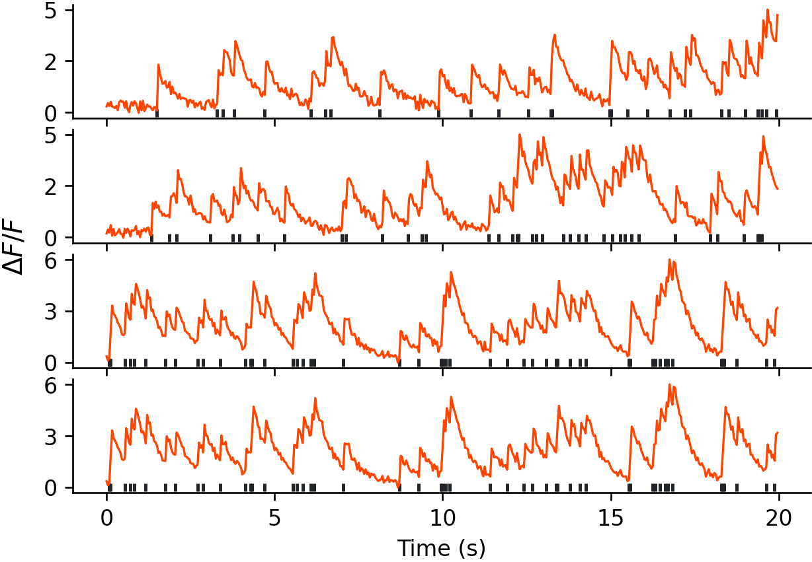

## spikes2calcium
A simple Python tool to convert spike trains to calcium fluorescence-like traces.

---

### Files
- [`spikes2calcium.py`](spikes2calcium.py) - the main function to convert spike trains to calcium-like traces using the method described in [Grewe et. al. 2010](https://www.nature.com/articles/nmeth.1453) (codebase in MATLAB: [github.com/HelmchenLab/CalciumSim](https://github.com/HelmchenLab/CalciumSim)).
- [`utils.py`](utils.py) - including plotting code and spike train generation code for demo purposes.

---

### Usage
```
import utils
from spikes2calcium import spikes2calcium

# generate spike trains from Poisson distribution
DURATION = 20  # duration of the simulation in s
NUM_NEURONS = 16  # number of neurons to simulate
FRAME_RATE = 24.0  # frame rate of the simulation
FIRING_RATE = 2.0  # firing rate in Hz

spike_trains = utils.generate_spike_trains(firing_rate=FIRING_RATE,
                                           duration=DURATION,
                                           num_neuorns=NUM_NEURONS,
                                           frame_rate=FRAME_RATE)

# convolve spike trains to calcium-like traces
traces = spikes2calcium(spike_trains=spike_trains, frame_rate=FRAME_RATE)

# plot the first 4 neurons
utils.plot_traces(traces=traces,
                  spike_trains=spike_trains,
                  frame_rate=FRAME_RATE,
                  filename='plots/traces.png',
                  show=False,
                  close=True)
```

### Example


---

### Installation
- Package required: `numpy`, `matplotlib`

